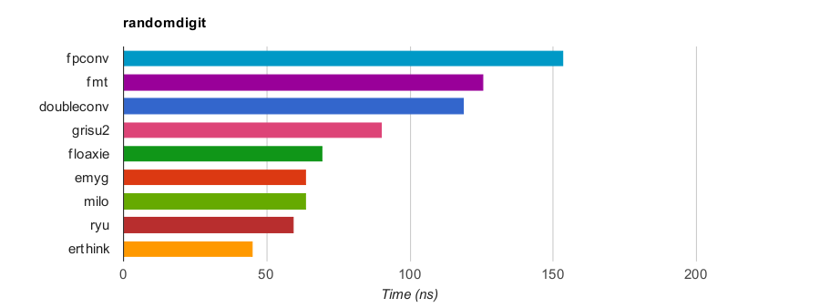

# dtoa Benchmark

Copyright(c) 2019-2020 Leonid Yuriev <leo@yuriev.ru>,
Copyright(c) 2014 Milo Yip <miloyip@gmail.com>

## Introduction

This benchmark evaluates the performance of conversion from double precision IEEE-754 floating point (`double`) to ASCII string. The function prototype is:

~~~~~~~~cpp
void dtoa(double value, char* buffer);
~~~~~~~~

The character string result **must** be convertible to the original value **exactly** via some correct implementation of `strtod()`, i.e. roundtrip convertible.

Note that `dtoa()` is *not* a standard function in C and C++.

## Procedure

Firstly the program verifies the correctness of implementations.

Then, **RandomDigit** case for benchmark is carried out:

* Generates 2000 random `double` values, filtered out `+/-inf` and `nan`. Then convert them to limited precision (1 to 17 decimal digits in significand).

* Convert these generated numbers into ASCII.

* Each digit group is run for 10000 times. The minimum time duration is measured for 42 trials.

## Build and Run

1. Obtain [cmake](https://cmake.org/download/)
2. Configure build system by running `cmake .` and build benchmark by running `cmake --build .`
3. On success, run the `dtoa-benchmark` executable is generated at `dtoa-benchmark/` or corresponding subdirectory (e.g `Release` on Windows).
4. The results in CSV format will be written to `dtoa-benchmark/result`.
5. Run GNU `make` in `dtoa-benchmark/result` to generate results in HTML.

## Results

The following are results measured by `RandomDigit` testcase on a PC (Core i7-4600U @2.10Ghz),
where `dtoa()` is compiled by GNU C++ 8.3 for x86-64 Linux.
The speedup is based on `sprintf`'s _Sum_ values.

Function      |  Min ns |  RMS ns  |  Max ns |   Sum ns  | Speedup |
:-------------|--------:|---------:|--------:|----------:|--------:|
erthink       |    25.9 |   46.083 |    62.8 |     764.1 | ×20.1   |
ryu           |    47.1 |   59.860 |    70.1 |    1010.0 | ×15.2   |
milo          |    42.7 |   64.336 |    78.1 |    1083.0 | ×14.2   |
emyg          |    42.2 |   64.330 |    77.8 |    1083.0 | ×14.2   |
floaxie       |    27.4 |   73.213 |    98.2 |    1181.0 | ×13.0   |
grisu2        |    73.4 |   90.677 |   109.3 |    1532.0 | ×10.0   |
doubleconv    |    78.7 |  120.223 |   150.7 |    2021.0 | ×7.6    |
fmt           |    97.3 |  126.511 |   151.5 |    2137.6 | ×7.2    |
fpconv        |   107.1 |  154.852 |   178.6 |    2611.5 | ×5.9    |
sprintf       |   826.0 |  904.252 |   968.1 |   15353.2 | ×1.0    |
ostrstream    |  1210.0 | 1289.817 |  1357.3 |   21912.5 | ×0.7    |
ostringstream |  1284.7 | 1374.006 |  1452.8 |   23338.3 | ×0.7    |

* [i7-4600U@2.10, linux-x86_64, GNU C/C++ 8.3](https://leo-yuriev.github.io/dtoa-benchmark/result/randomdigit_i7-4600U@2.10_linux-x86_64-gcc8.3.html)
* [i7-7820@2.90, linux-x86_64, GNU C/C++ 9.1](https://leo-yuriev.github.io/dtoa-benchmark/result/randomdigit_i7-7820@2.90_linux-x86_64-gcc9.1.html)

## Implementations

Function      | Description
--------------|-----------
sprintf       | `sprintf()` in C standard library with `"%.17g"` format.
[gay](http://www.netlib.org/fp/) | David M. Gay's `dtoa()` C implementation.
[grisu2](http://florian.loitsch.com/publications/bench.tar.gz?attredirects=0) | Florian Loitsch's Grisu2 C implementation [1].
[doubleconv](https://code.google.com/p/double-conversion/) |  C++ implementation extracted from Google's V8 JavaScript Engine with `EcmaScriptConverter().ToShortest()` (based on Grisu3, fall back to slower bignum algorithm when Grisu3 failed to produce shortest implementation).
[fpconv](https://github.com/night-shift/fpconv) | [night-shift](https://github.com/night-shift)'s  Grisu2 C implementation.
[milo](https://github.com/miloyip/dtoa-benchmark/blob/master/src/milo/dtoa_milo.h) | Milo Yip's Grisu2 C++ header-only implementation.
[erthink](https://github.com/leo-yuriev/erthink/blob/master/erthink_d2a.h) | Leonid Yuriev's Grisu2 C++ header-only implementation.
[ryu](https://github.com/ulfjack/ryu) | Ulf Adams's [Ryū algorithm](https://dl.acm.org/citation.cfm?id=3192369).
null          | Do nothing. It measures the overheads of looping and function call
ostringstream | `std::ostringstream` in C++ standard library with `setprecision(17)`.
ostrstream    | `std::ostrstream` in C++ standard library with `setprecision(17)`.

## FAQ

1. How to add an implementation?

   You may clone an existing implementation file, then modify it and add to `CMakeLists.txt`.
   Re-run `cmake` to re-configure and re-build benchmark.
   Note that it will automatically register to the benchmark by macro `REGISTER_TEST(name)`.

   **Making pull request of new implementations is welcome.**

2. Why not converting `double` to `std::string`?

   It may introduce heap allocation, which is a big overhead. User can easily wrap these low-level functions to return `std::string`, if needed.

3. Why fast `dtoa()` functions is needed?

   They are a very common operations in writing data in text format. The standard way of `sprintf()`, `std::stringstream`, often provides poor performance. The author of this benchmark would optimize the `sprintf` implementation in [RapidJSON](https://github.com/miloyip/rapidjson/).

## References

[1] Loitsch, Florian. ["Printing floating-point numbers quickly and accurately with integers."](http://florian.loitsch.com/publications/dtoa-pldi2010.pdf) ACM Sigplan Notices 45.6 (2010): 233-243.

## Related Benchmarks and Discussions

* [Printing Floating-Point Numbers](http://www.ryanjuckett.com/programming/printing-floating-point-numbers/)

--------------------------------------------------------------------------------

### The [repository now only mirrored on the Github](https://abf.io/erthink/d2a-benchmark) due to illegal discriminatory restrictions for Russian Crimea and for sovereign crimeans.
<!-- Required extensions: pymdownx.betterem, pymdownx.tilde, pymdownx.emoji, pymdownx.tasklist, pymdownx.superfences -->
